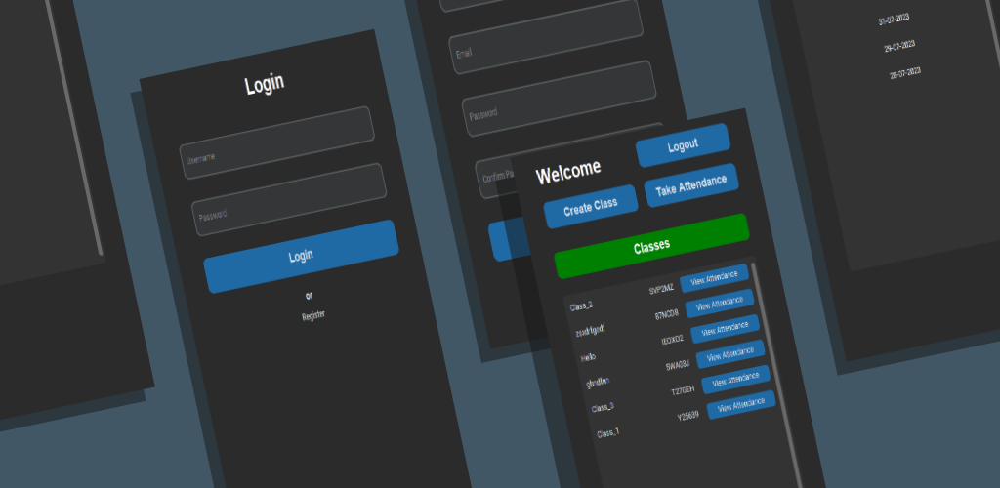

# Attendance Management System with Biometric Integration



This is a Python desktop application built using the `customtkinter` 
library to manage attendance for classes. The application allows teachers
to register, log in, create classes, and record attendance. Additionally,
it integrates with an Android app for biometric-based student attendance
using biometric scans.

## Features

- User Registration and Login: Users can create accounts and log in securely.
- Class Creation: Logged-in users can create classes and manage class details.
- Attendance Recording: Teachers can mark attendance for students in each class.
- Biometric Integration: Students can use the Android app to provide attendance through biometric scans.
- Data Security: User authentication and authorization ensure data security.
- User-friendly Interface: The `customtkinter` GUI provides an intuitive and interactive experience.

## Installation

1. Clone the repository:

   ```bash
   git clone https://github.com/Masum-MSNR/attendance-teacher.git
   cd attendance-teacher

2. Install the dependencies:

   ```bash
   pip install -r requirements.txt
   ```
   
3. Run the application:

   ```bash
    python main.py
    ```
## Customtkinter
Full documentation for the `customtkinter` library can be found [here](https://customtkinter.tomschimansky.com/documentation/).

## Contact

If you have any questions or suggestions, please feel free to contact me at [nam.cse.ruet@gmail.com](mailto:nam.cse.ruet@gmail.com).